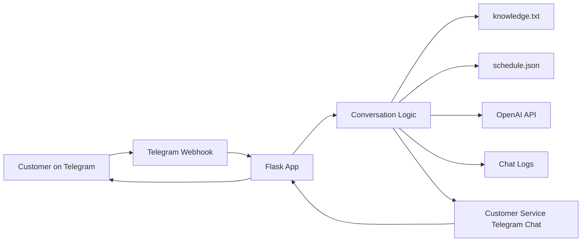

# Jal Yoga Singapore Telegram AI Assistant

An AI-powered customer-service assistant built for Jal Yoga Singapore. The system helps customers get fast answers through Telegram, supports booking-related flows, recommends the nearest studio, and passes complex cases to a real Customer Service team.

## Project Summary

This project is a practical AI chatbot for a real service business. It combines a Flask backend, Telegram webhook integration, OpenAI responses, structured business knowledge, schedule data, chat logging, and human handoff tools.

The goal is simple: reduce repetitive customer-service workload while keeping customers supported when a human response is needed.

## Business Problem

Fitness and wellness studios receive many repeated enquiries every day:

- Where are your outlets?
- Which outlet is nearest to me?
- What is the class schedule?
- How do I book a trial?
- What is the cancellation policy?
- Can I speak to Customer Service?

Without automation, staff spend time answering the same questions manually. This bot handles common enquiries immediately and routes more sensitive or account-specific requests to the correct support team.

## Key Capabilities

- Telegram customer chatbot
- AI replies based on approved Jal Yoga knowledge
- Trial class enquiry flow
- Current member support flow
- Studio location and operating enquiry support
- Nearest outlet recommendation based on area or postal code
- Class schedule replies from `schedule.json`
- Corporate and partnership enquiry collection
- Refer-a-friend flow
- Staff Hub request flow
- Customer Service handoff through Telegram
- Live support reply commands
- Local and deployed chat logs
- Debug routes for operations and support
- File ingestion tool for updating the knowledge base

## How It Works



The app receives Telegram messages through a webhook. It checks the customer message, continues any active flow, looks up approved knowledge or schedule data, uses OpenAI when needed, and sends a reply back to Telegram. If the request needs a human, it forwards the case to Customer Service.

## Technology Stack

| Area | Technology |
| --- | --- |
| Backend | Python, Flask |
| AI | OpenAI API |
| Messaging | Telegram Bot API |
| Deployment | Render-compatible, Gunicorn |
| Data files | `knowledge.txt`, `schedule.json`, Google Sheets chat logs |
| File processing | PyMuPDF, python-docx, openpyxl, python-pptx |

## Main User Flows

### Customer Menu

Customers can choose from:

1. Schedule a Trial
2. Current Member Support
3. General Jal Yoga Enquiry
4. Corporate / Partnerships
5. Staff Hub

They can also type natural language questions instead of selecting menu numbers.

### Trial Booking Support

The bot asks for the preferred outlet, customer name, and trial goal. If the customer is unsure which outlet to visit, the bot can suggest the likely nearest outlet based on location, MRT station, area, or postal code.

### Schedule Replies

The bot reads `schedule.json` and can answer schedule-related questions such as:

- classes today
- classes tomorrow
- schedule at a selected outlet
- trial class timings

### Customer Service Handoff

When a request is too specific, uncertain, or sensitive, the bot sends a summary to Customer Service. Staff can reply from Telegram using support commands or direct reply workflows.

## Human Support Commands

Customer Service can reply from the configured support Telegram chat:

```text
/reply CUSTOMER_CHAT_ID your message
/close CUSTOMER_CHAT_ID
```

This allows staff to continue a customer conversation without needing to access the server directly.

## Project Structure

| File or folder | Purpose |
| --- | --- |
| `app.py` | Main application, Telegram webhook, conversation flows, OpenAI calls, handoff logic, schedules, and debug routes. |
| `knowledge.txt` | Approved Jal Yoga information used by the bot. |
| `schedule.json` | Class schedule data. |
| `auto_file_to_knowledge.py` | Imports uploaded file contents into `knowledge.txt`. |
| `templates/index.html` | Basic web homepage for the app. |
| `requirements.txt` | Python dependencies. |
| `uploads/` | Folder for files that should be processed into the knowledge base. |
| `chatlogs/` | Optional local per-chat JSONL logs, ignored by Git. |

## Complete Setup Checklist

Follow these steps in order to make the full system work.

### 1. Install Python

Install Python 3.10 or newer from:

```text
https://www.python.org/downloads/
```

During installation, tick:

```text
Add python.exe to PATH
```

Check that Python works:

```powershell
python --version
```

If this opens the Microsoft Store, disable the Microsoft Store Python shortcut in Windows settings or reinstall Python from `python.org`.

### 2. Open the Project Folder

Open PowerShell in this folder:

```text
c:\Users\Ben Ong\OneDrive\Desktop\TO BE SAFE
```

Or in VS Code:

```text
File -> Open Folder -> TO BE SAFE
```

### 3. Create the Virtual Environment

```powershell
python -m venv .venv
.\.venv\Scripts\Activate.ps1
```

If PowerShell blocks activation, run:

```powershell
Set-ExecutionPolicy -Scope CurrentUser RemoteSigned
```

Then activate again:

```powershell
.\.venv\Scripts\Activate.ps1
```

### 4. Install Required Packages

```powershell
python -m pip install --upgrade pip
python -m pip install -r requirements.txt
```

This installs Flask, OpenAI, Telegram request support, file readers, and the tools needed by the helper scripts.

### 5. Select the Correct Python Interpreter in VS Code

In VS Code:

```text
Ctrl + Shift + P
Python: Select Interpreter
Choose .venv\Scripts\python.exe
```

This fixes yellow warning lines under imports such as `flask`, `openai`, `dotenv`, and `watchdog`.

### 6. Create the Telegram Bot

In Telegram:

1. Open `@BotFather`.
2. Send `/newbot`.
3. Choose the bot name and username.
4. Copy the bot token.

The token goes into:

```env
TELEGRAM_BOT_TOKEN=
```

### 7. Create an OpenAI API Key

Create an OpenAI API key and add it to:

```env
OPENAI_API_KEY=
```

The model is configured with:

```env
OPENAI_MODEL=gpt-5.4-mini
```

### 8. Create the `.env` File

Create a file called `.env` in the project root.

Minimum local setup:

```env
OPENAI_API_KEY=your_openai_api_key
OPENAI_MODEL=gpt-5.4-mini

TELEGRAM_BOT_TOKEN=your_telegram_bot_token
TELEGRAM_SECRET_TOKEN=choose_any_private_random_text
TELEGRAM_BOT_USERNAME=your_bot_username

CUSTOMER_SERVICE_TELEGRAM_CHAT_ID=
CUSTOMER_SERVICE_WHATSAPP_NUMBER=65xxxxxxxx

DEBUG_ROUTE_TOKEN=choose_any_private_debug_token
PORT=5000

SCHEDULE_FILE=schedule.json
OPT_OUT_FILE=telegram_opt_out_users.json

CHATLOG_ENABLED=true
GOOGLE_SHEET_ID=your_google_sheet_id
GOOGLE_SHEET_WORKSHEET=Chat Logs
GOOGLE_SERVICE_ACCOUNT_FILE=google-service-account.json
GOOGLE_SERVICE_ACCOUNT_JSON=
GOOGLE_SERVICE_ACCOUNT_JSON_BASE64=
CHATLOG_LOCAL_ENABLED=false
CHATLOG_MAX_VIEW_LINES=300
AUTO_START_INACTIVITY_CHECKER=true
```

Share the Google Sheet with the service account email as an Editor. For Render, use `GOOGLE_SERVICE_ACCOUNT_JSON` or `GOOGLE_SERVICE_ACCOUNT_JSON_BASE64` instead of uploading a local credentials file.

The Google Sheet header row should be:

```text
timestamp_sg | chat_id | chat_type | username | directions | role | message
```

Keep `.env` private. Do not upload real tokens, API keys, or service account files to GitHub.

### 9. Test the Flask App Locally

Run:

```powershell
.\.venv\Scripts\Activate.ps1
python app.py
```

Open:

```text
http://localhost:5000
http://localhost:5000/health
```

The `/health` page should show whether OpenAI, Telegram, Customer Service, schedules, and chat logs are configured.

### 10. Get the Customer Service Telegram Chat ID

The bot needs a Customer Service chat ID if human handoff should work.

For a private support chat:

1. Send a message to the bot from the Customer Service Telegram account.
2. Check the app logs or chat logs for the `chat_id`.
3. Add that value to:

```env
CUSTOMER_SERVICE_TELEGRAM_CHAT_ID=
```

For a group support chat:

1. Add the bot to the Telegram group.
2. Send a message in the group.
3. Check the app logs for the group `chat_id`.
4. Add that value to `CUSTOMER_SERVICE_TELEGRAM_CHAT_ID`.

Telegram group chat IDs are often negative numbers. That is normal.

### 11. Deploy to Render

Create a new Render Web Service and connect the project repository.

Use these settings:

```text
Build command:
pip install -r requirements.txt

Start command:
gunicorn app:app
```

Add the same environment variables from `.env` into Render's environment settings.

Important Render variables:

```env
OPENAI_API_KEY=
OPENAI_MODEL=gpt-5.4-mini
TELEGRAM_BOT_TOKEN=
TELEGRAM_SECRET_TOKEN=
CUSTOMER_SERVICE_TELEGRAM_CHAT_ID=
CUSTOMER_SERVICE_WHATSAPP_NUMBER=
DEBUG_ROUTE_TOKEN=
CHATLOG_ENABLED=true
AUTO_START_INACTIVITY_CHECKER=true
```

After deployment, open:

```text
https://your-app.onrender.com/health
```

### 12. Set the Telegram Webhook

Telegram must be told where to send messages.

In PowerShell:

```powershell
$botToken = "YOUR_TELEGRAM_BOT_TOKEN"
$webhookUrl = "https://your-app.onrender.com/telegram/webhook"
$secret = "YOUR_TELEGRAM_SECRET_TOKEN"

Invoke-RestMethod `
  -Uri "https://api.telegram.org/bot$botToken/setWebhook" `
  -Method Post `
  -Body @{
    url = $webhookUrl
    secret_token = $secret
  }
```

Check webhook status:

```powershell
Invoke-RestMethod -Uri "https://api.telegram.org/bot$botToken/getWebhookInfo"
```

The webhook URL should be:

```text
https://your-app.onrender.com/telegram/webhook
```

### 13. Test the Live Telegram Bot

Open the Telegram bot and send:

```text
/start
menu
which outlet is near Tampines?
I want to book a trial
customer service
```

Check Render logs if Telegram does not reply.

### 14. Test Chat Logs

Open:

```text
https://your-app.onrender.com/debug/test-chatlog?token=YOUR_DEBUG_ROUTE_TOKEN
```

Then check:

```text
https://your-app.onrender.com/debug/chat-log-file?token=YOUR_DEBUG_ROUTE_TOKEN&limit=100
```

### 15. Update Knowledge

Main bot information is stored in:

```text
knowledge.txt
```

After editing `knowledge.txt`, restart the app or redeploy Render so the bot loads the latest version.

To import files automatically:

```powershell
.\.venv\Scripts\Activate.ps1
python auto_file_to_knowledge.py
```

Then place files into:

```text
uploads/
```

Review imported content before relying on it.

### 16. Update Schedule

Class schedule data is stored in:

```text
schedule.json
```

After editing the schedule, restart locally or redeploy on Render.

### 17. Final Working Check

Before showing the project to a company, confirm:

- `python app.py` opens `/health`.
- Render deploy is successful.
- `/health` on Render shows the correct configuration.
- Telegram webhook is set.
- Telegram bot replies to `/start`.
- Trial flow works.
- Nearest outlet question works.
- Schedule question works.
- Customer Service handoff works.
- Chat logs are being written.
- No real secrets are committed to GitHub.

## Local Demo

Install dependencies:

```powershell
python -m venv .venv
.\.venv\Scripts\Activate.ps1
python -m pip install --upgrade pip
python -m pip install -r requirements.txt
```

Run the Flask app locally:

```powershell
python app.py
```

Then open:

```text
http://localhost:5000
http://localhost:5000/health
```

## Environment Variables

The app uses environment variables for secrets and deployment settings:

```env
OPENAI_API_KEY=
OPENAI_MODEL=gpt-5.4-mini

TELEGRAM_BOT_TOKEN=
TELEGRAM_SECRET_TOKEN=
TELEGRAM_BOT_USERNAME=

CUSTOMER_SERVICE_TELEGRAM_CHAT_ID=
CUSTOMER_SERVICE_WHATSAPP_NUMBER=

DEBUG_ROUTE_TOKEN=
PORT=5000

SCHEDULE_FILE=schedule.json
OPT_OUT_FILE=telegram_opt_out_users.json

CHATLOG_ENABLED=true
GOOGLE_SHEET_ID=
GOOGLE_SHEET_WORKSHEET=Chat Logs
GOOGLE_SERVICE_ACCOUNT_FILE=google-service-account.json
GOOGLE_SERVICE_ACCOUNT_JSON=
GOOGLE_SERVICE_ACCOUNT_JSON_BASE64=
CHATLOG_LOCAL_ENABLED=false
CHATLOG_MAX_VIEW_LINES=300
AUTO_START_INACTIVITY_CHECKER=true
```

Optional outlet-specific support settings:

```env
ALEXANDRA_TELEGRAM_CHAT_ID=
KATONG_TELEGRAM_CHAT_ID=
KOVAN_TELEGRAM_CHAT_ID=
UPPER_BUKIT_TIMAH_TELEGRAM_CHAT_ID=
WOODLANDS_TELEGRAM_CHAT_ID=

ALEXANDRA_WHATSAPP_NUMBER=
KATONG_WHATSAPP_NUMBER=
KOVAN_WHATSAPP_NUMBER=
UPPER_BUKIT_TIMAH_WHATSAPP_NUMBER=
WOODLANDS_WHATSAPP_NUMBER=
```

## Deployment Overview

The app is ready for deployment on Render or another Python web host.

Recommended Render settings:

```text
Build command:
pip install -r requirements.txt

Start command:
gunicorn app:app
```

After deployment, set the Telegram webhook:

```powershell
$botToken = "YOUR_TELEGRAM_BOT_TOKEN"
$webhookUrl = "https://your-app.onrender.com/telegram/webhook"
$secret = "YOUR_TELEGRAM_SECRET_TOKEN"

Invoke-RestMethod `
  -Uri "https://api.telegram.org/bot$botToken/setWebhook" `
  -Method Post `
  -Body @{
    url = $webhookUrl
    secret_token = $secret
  }
```

## Operational Tools

### Health Check

```text
/health
```

Shows whether OpenAI, Telegram, Customer Service, schedule data, and chat logging are configured.

### Debug Routes

Debug routes require `DEBUG_ROUTE_TOKEN`:

```text
/debug/outlets?token=YOUR_DEBUG_ROUTE_TOKEN
/debug/schedule?token=YOUR_DEBUG_ROUTE_TOKEN
/debug/trial-bookings?token=YOUR_DEBUG_ROUTE_TOKEN
/debug/chatlogs?token=YOUR_DEBUG_ROUTE_TOKEN
/debug/chatlog?token=YOUR_DEBUG_ROUTE_TOKEN&chat_id=CHAT_ID
/debug/chat-log-file?token=YOUR_DEBUG_ROUTE_TOKEN&limit=100
/debug/test-chatlog?token=YOUR_DEBUG_ROUTE_TOKEN
```

## Updating Knowledge

The bot's approved information lives in `knowledge.txt`.

To manually update the bot:

1. Edit `knowledge.txt`.
2. Keep information factual and confirmed.
3. Restart the app after changes.

To import documents:

```powershell
python auto_file_to_knowledge.py
```

Then place supported files into:

```text
uploads/
```

Supported formats:

```text
.pdf, .txt, .md, .docx, .csv, .xlsx, .pptx, .json
```

Imported text should be reviewed before being treated as final business knowledge.

## Privacy and Safety

The bot is designed with basic customer-data safety in mind:

- Secrets are loaded from environment variables.
- `.env`, chat logs, and generated local files are ignored by Git.
- The bot avoids asking for NRIC, passport numbers, CVV, OTP, passwords, bank account details, or medical documents.
- Chat logs lightly redact emails, OTP-style phrases, and long ID/card-style numbers.
- Debug routes require a private token.
- Uncertain or sensitive questions are handed to Customer Service.

## What This Demonstrates

This project demonstrates the ability to:

- Build a real AI assistant around business workflows.
- Integrate Telegram, Flask, and OpenAI.
- Design structured chatbot flows instead of relying only on free-form AI.
- Add human handoff for operational reliability.
- Use local files as a lightweight knowledge and schedule system.
- Build debugging and logging tools for a deployed chatbot.
- Prepare an app for real deployment and business review.

## Possible Future Improvements

- Admin dashboard for editing schedules and knowledge.
- Database storage for chat history and bookings.
- Authentication for support staff.
- Analytics for common customer enquiries.
- Rich Telegram buttons instead of text-only menus.
- CRM or booking-system integration.
